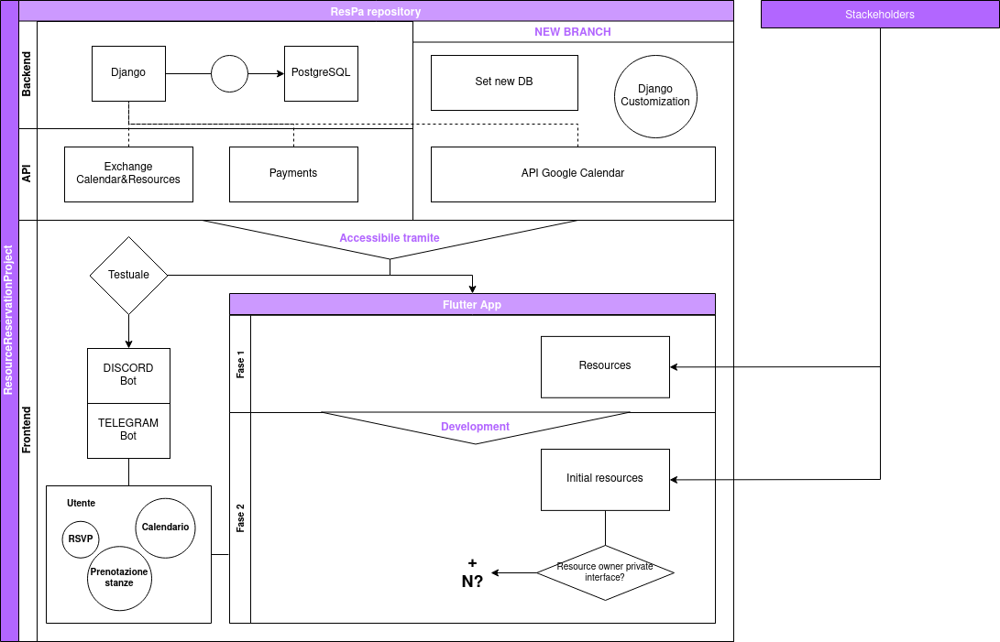

# **ResourceReservationProject**
This is a simple but complete exercise to learning Python.

## Task and flow chart
We are going to do a new fork of the existing ResPa project from Helsinki City with some major difference. The goal is to have a resource booking app.

The app books some tables from a list of pubs (or discord servers). When you book a table there a google calendar event will be associated with it.

## What we are going to study?

| **Subject** | **Element** | **Description** |
| ------ | ------ | ------ |
| Database | MongoDB and PostgreSQL | Analyze and rewrite |
| Backend | The main code is in Python, Django module | Analyze and rewrite |
| API | REST architecture, Flask module, Interface | Write from scratch |
| CLI Frontend | Telegram and Discord API for BOT | Write from scratch |
| Frontend | Flutter module | For application interface |

## languages

- Python
- SQL
- JavaScript
- Shell

## STEPS

- Create a study group.
- Discuss the competences to learn and needs.
- Study ResPa code.
- Create new branch of ResPa.
- Rewrite Django backend into flask.
- Rewrite SQL DB to a NoSQL DB.
- Write Telegram and Discord interfaces.
- Write Unittest for each module.
- Develop the app into docker and kubernetes (The app must be cloud native).

Then we could also:
- Write an interface of an Android/iOS app with Flutter

## Link and resources

- Discord Server: https://discord.gg/qMUPBgkW
- Architecture Diagram: https://drive.google.com/file/d/1XPH84nWvgRdFZSbuQdKIeymoLe_cK1_a/view?usp=sharing
- Conventional Commits: https://www.conventionalcommits.org/en/v1.0.0/#summary
